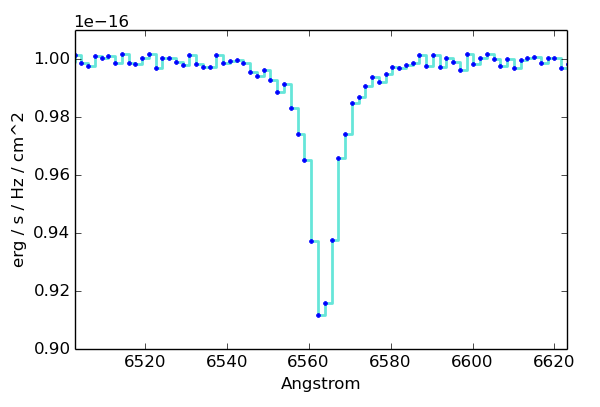

# Tarea nro. 11
## FI3104B - Métodos Numéricos para la Ciencia y la Ingeniería
#### Prof. Valentino González

## P1

En esta tarea, Ud. modelará una línea de absorción de una observación
espectroscópica similar a la tarea anterior ([ver tarea como
referencia](https://github.com/uchileFI3104B-2015B/10Tarea)), pero esta vez
utilizando técnicas Bayesianas.

Ésta vez también haremos un par de simplificaciones con respecto a la tarea
anterior:

1. El nivel del contínuo es una constante = 1e-16.
1. La longitud de onda del centro de la línea es conocido: 6563 &#x212B;.

El espectro que debe modelar se encuentra en el archivo `espectro.dat`, en
unidades de flujo por unidad de frecuencia f&nu; [erg s-1
Hz-1 cm-2] vs. longitud de onda en [&#x212B;].

La línea que debe modelar, al igual que en la tarea anterior, no es una gausiana
sino que algo más complicado. Ud. nuevamente seguirá dos procedimientos para
modelar el espectro y luego comparará los resultados de los dos modelos.

1. Línea gaussiana simple. Note que como la longitud de onda central es
   conocida, el modelo tiene sólo dos parámetros libres.
1. Línea gaussiana doble. Cuando realice el modelo anterior se dará cuenta de
   que el modelo falla levemente al reproducir las *alas* de la línea. Para
   mejorar el modelo, se puede intentar modelar la línea como la suma de dos
   gaussianas. Un modelo como ese está representado en la siguiente figura.

   

   Las líneas punteadas son las dos gausianas simples cuya suma corresponde a la
   línea azul contínua. La curva roja representa el espectro. Como se aprecia,
   la suma de las dos gausianas simples representa bastante bien al espectro (el
   cual no es originalmente una suma de dos gausianas). El mejor fit se obtiene
   a cambio de un modelo más complejo: esta vez son dos gaussianas de centro
   conocido por lo que el modelo tiene 4 parámetros.

Para cada uno de los dos modelos estime, usando métodos Bayesianos, los
parámetros (por ejemplo la esperanza E[&theta;], de los parámetros), y sus
intervalos de 68% de confianza, que en estadística Bayesiana se llaman
intervalos de credibilidad.

> NOTA 1: Ud. deberá definir probabilidades a priori para cada uno de los
> parámetros de los modelos. Sea explícito en su informe sobre cuales fuernos
> sus elecciones y su justificación.
>
> NOTA 2: para la verosimilitud, necesitará los errores asociados a cada punto
> (pixel). Esta vez asumiremos que los errores son gaussianos y constantes a lo
> largo del espectro. Dado que el contínuo es conocido, Ud. puede estimar el
> *ruido* mirando la variación de los puntos con respecto al valor del contínuo
> conocido. Explicite en su informe el valor que determinó.

# P2.

Como se mencionó antes, el modelo de dos gaussianas debe producir un mejor fit
de los datos, pero a cambio de tener el doble de parámetros libres que el modelo
de una gaussiana simple. Utilice métodos de selección Bayesiana de modelos para
decidir cuál de los dos modelos es una mejor representación de los datos.
Justifique su decisión.

> NOTA: Ud. deberá realizar una integral en 4 dimensiones en algún momento.
> Describa claramente el procedimiento que eligió para hacer dicha integral.

__Otras Notas.__

- Ud. debe decidir qué es interesante y crear las figuras correspondientes.

- Utilice `git` durante el desarrollo de la tarea para mantener un historial de
  los cambios realizados. La siguiente [*cheat
  sheet*](https://education.github.com/git-cheat-sheet-education.pdf) le puede
  ser útil. Evaluaremos el uso efectivo de `git`. Recuerde hacer cambios
  significativos pero relativamente pequeños y guardar seguido.  Evite hacer
  `commits` de código que no compila y deje mensajes que permitan entender los
  cambios realizados.

- Evaluaremos su uso correcto de python. Si define una función relativamente
  larga o con muchos parámetros, recuerde escribir el *doctsring* que describa
  los parámetros y que es lo que hace la función.  También recuerde usar nombres
  explicativos para las variables y las funciones.  El mejor nombre es aquel que
  permite entender que hace la función sin tener que leer su implementación.

- Los códigos entregados deben pasar las reglas de
  [PEP8](https://www.python.org/dev/peps/pep-0008/). En la línea de comando
  puede intentar `pep8 <script.py>` y asegurarse de que no hay errores ni
  advertencias. Los comandos `pep8 --show-source <script.py>` y `pep8
  --show-pep8 <script.py>` que vimos en clase le pueden ser útiles. Si es de
  aquellos que resuelven su tarea usando el `ipython notebook`, entonces exporte
  la tarea a un archivo normal de `python` y asegúrese de que pasa el test de
  PEP8.

- La tarea se entrega como un *pull request* en github. El *pull request* debe
  incluir todos los códigos usados además de su informe.

- El informe debe ser entregado en formato *pdf*, este debe ser claro sin
  información ni de más ni de menos.
